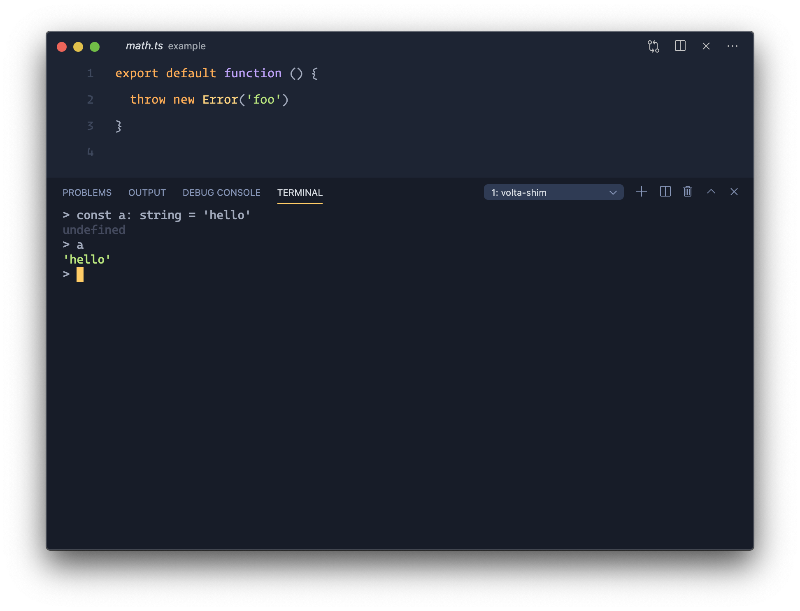
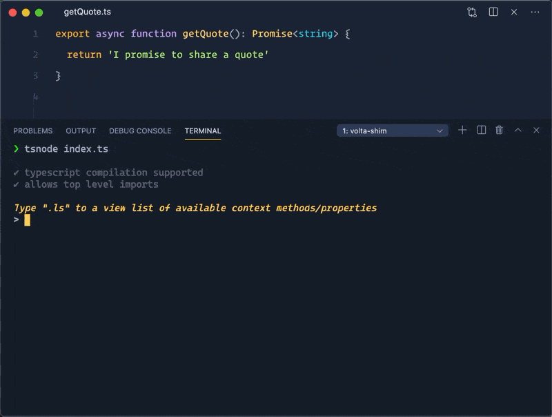
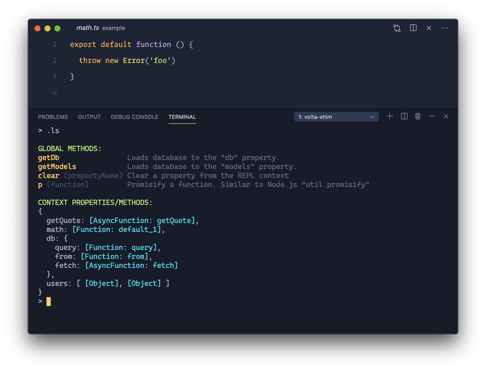
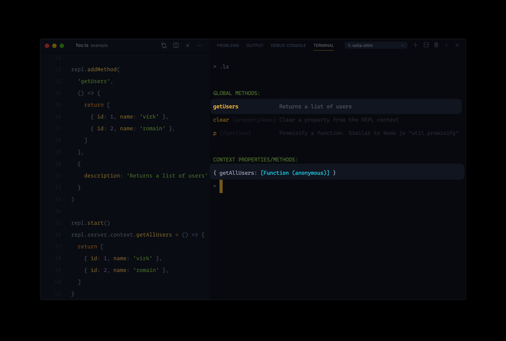

<div align="center">
  <h3> Node.JS REPL </h3>
  <p>A slick Node.js REPL with first class support for <strong>top level await</strong> and <strong>typescript compilation</strong></p>
</div>

<br />

<div align="center">

[![circleci-image]][circleci-url] [![npm-image]][npm-url] ![][typescript-image] [![license-image]][license-url] [![audit-report-image]][audit-report-url]

</div>

<div align="center">
  <h3>
    <a href="#installation">
      Usage
    </a>
    <span> | </span>
    <a href="CONTRIBUTING.md">
      Contributing
    </a>
    <span> | </span>
    <a href="https://preview.adonisjs.com">
      Checkout AdonisJS
    </a>
  </h3>
</div>

<div align="center">
  <sub>Built with ❤︎ by <a href="https://github.com/thetutlage">Harminder Virk</a>
</div>

<br />


<hr />

AdonisJS REPL is a standalone and framework agnostic package to create custom Node.js REPL with first class support for:

- ✅ Execute typescript code with in-memory compilation.
- ✅ Support for top level await keyword.
- ✅ Ability to define custom method with a help description.

<!-- START doctoc generated TOC please keep comment here to allow auto update -->
<!-- DON'T EDIT THIS SECTION, INSTEAD RE-RUN doctoc TO UPDATE -->
## Table of contents

- [Installation](#installation)
- [Usage](#usage)
  - [Typescript support](#typescript-support)
  - [History file](#history-file)
- [Accurate Stack Trace](#accurate-stack-trace)
- [The `.ls` command](#the-ls-command)
- [Adding custom properties](#adding-custom-properties)
  - [Global methods](#global-methods)

<!-- END doctoc generated TOC please keep comment here to allow auto update -->

## Installation
Install the package from the npm registry as follows:

```sh
npm i @adonisjs/repl

# Yarn
yarn add @adonisjs/repl
```

## Usage

Import the `Repl` class from the standalone module.

```ts
import { Repl } from '@adonisjs/repl/build/standalone'
const repl = new Repl()

repl.start()
```

### Typescript support
You will have to make use of [@adonisjs/require-ts](https://npm.im/@adonisjs/require-ts) in order for the REPL to compile and run the typescript code. For example:

```ts
import { loadCompiler } from '@adonisjs/require-ts'
import { Repl } from '@adonisjs/repl/build/standalone'

const compilerOptions = {
  'target': 'es2019',
  'module': 'commonjs',
  'allowSyntheticDefaultImports': true,
  'esModuleInterop': true
}

const repl = new Repl(loadCompiler(compilerOptions))
```

If you are using `@adonisjs/require-ts` as a require hook, then there is no need to instantiate another instance of the compiler as you can reference the compiler instance from the global object.

```ts
const compiler = global[Symbol.for('REQUIRE_TS_COMPILER')]
const repl = new Repl(compiler)
```

And now run the file containing the above code as follows:

```ts
node -r @adonisjs/require-ts/build/register repl.ts
```



### History file
AdonisJS REPL allows you store the commands history inside a file so that the subsequent sessions can reference the commands executed in an earlier session.

You need to just pass the path to the history file and rest is taken care for you.

```ts
import { join } from 'path'
import { homedir } from 'os'
import { Repl } from '@adonisjs/repl/build/standalone'

const repl = new Repl(compiler, join(homedir(), '.adonis_repl_history'))

repl.start()
```



## Accurate Stack Trace
The stack trace for the Typescript files points back to the correct file, line and the column number.


## The `.ls` command
The `.ls` command prints the REPL session context. The output is divided to two sections.



- **Global Methods** are the methods in the repl context object, but has some description associated with them.
- **Context properties**: are the properties/methods in the context object. Only the first level of properties are printed on the console (to avoid noisy output).

## Adding custom properties
If you are aware about the [Node.js repl context](https://nodejs.org/dist/latest-v14.x/docs/api/repl.html#repl_global_and_local_scope), then you would know that you can add properties to the context as follows:

```ts
// NODE.JS EXAMPLE
const { start } = require('repl')

const server = start({})
server.context.foo = 'bar'
```

Similarly, you can add properties to the AdonisJS repl `context` by referencing the underlying `server` property.

```ts
import { Repl } from '@adonisjs/repl/build/standalone'

const repl = new Repl().start()
repl.server.context.foo = 'bar'
```

### Global methods
In addition to adding properties to the `context` directly. You can also define custom methods with a description and its usage text. For example:

```ts
import { Repl } from '@adonisjs/repl/build/standalone'
const repl = new Repl()

repl.addMethod('getUsers', () => {
	return [{ id: 1, name: 'virk' }, { id: 2, name: 'romain' }]
}, {
	description: 'Returns a list of users',
})

repl.start()
```

There is no technical advantage for using `addMethod` over adding properties to the `context` directly. It's just that `addMethod` properties are given special treatment during the [.ls command](#ls-command). 

Checkout the following example



[circleci-image]: https://img.shields.io/circleci/project/github/adonisjs/repl/master.svg?style=for-the-badge&logo=circleci
[circleci-url]: https://circleci.com/gh/adonisjs/repl "circleci"

[typescript-image]: https://img.shields.io/badge/Typescript-294E80.svg?style=for-the-badge&logo=typescript
[typescript-url]:  "typescript"

[npm-image]: https://img.shields.io/npm/v/@adonisjs/repl.svg?style=for-the-badge&logo=npm
[npm-url]: https://npmjs.org/package/@adonisjs/repl "npm"

[license-image]: https://img.shields.io/npm/l/@adonisjs/repl?color=blueviolet&style=for-the-badge
[license-url]: LICENSE.md "license"

[audit-report-image]: https://img.shields.io/badge/-Audit%20Report-blueviolet?style=for-the-badge
[audit-report-url]: https://htmlpreview.github.io/?https://github.com/adonisjs/repl/blob/develop/npm-audit.html "audit-report"
